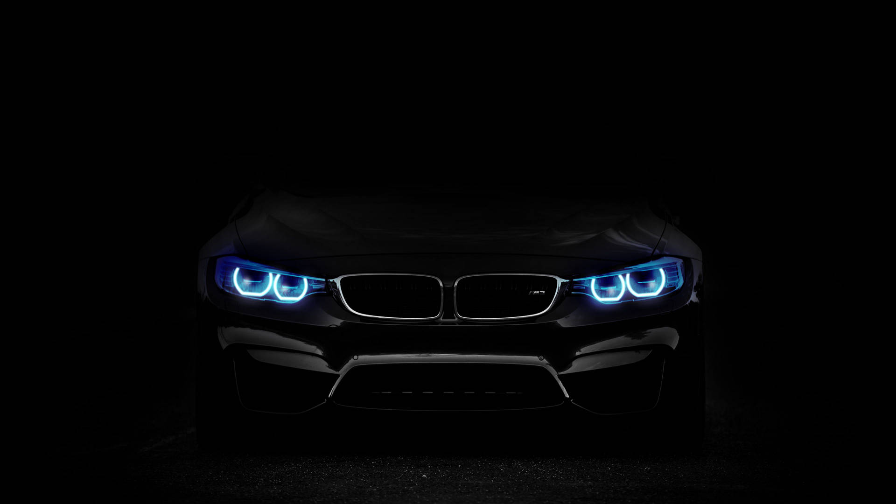

# 🔐 Login & SignUp Page

A stylish, animated **Login and Registration** popup UI built with **HTML**, **CSS**, and **vanilla JavaScript** — featuring a glassmorphism design over a dark car background.

---

## 📸 Preview



> The login/register popup appears over a dark BMW background with a frosted glass card effect.

---

## 📸 Screenshot


## ✨ Features

- 🔲 **Popup modal** — Login form opens as a smooth popup when clicking the "Login" button in the nav
- 🔄 **Toggle between Login & Register** — Slides between forms with a clean CSS transition
- ❌ **Close button** — Dismiss the popup anytime
- 🎨 **Glassmorphism UI** — Frosted glass card with `backdrop-filter: blur`
- 🖊️ **Floating Labels** — Labels animate upward when you start typing
- 🔗 **Animated nav links** — Underline slides in on hover
- 📱 **Responsive-ready layout** using Flexbox
- 🎯 **Ionicons** for mail, lock, and person icons

---

## 🗂️ Project Structure

```
login-signup/
├── index.html       # Page structure (header, login form, register form)
├── style.css        # Glassmorphism styling, animations, transitions
├── script.js        # Popup open/close and form toggle logic
└── background.jpg   # Dark BMW background image
```

---

## 🚀 How to Run

No installation or server needed — just open locally:

1. **Clone this repository**
   ```bash
   git clone https://github.com/mahfooz091/login-signup.git
   ```

2. **Open `index.html` in your browser**
   ```bash
   cd login-resgitrationDashboard
   open index.html
   ```
   Or simply double-click `index.html` in your file explorer.

> ⚠️ Make sure `background.jpg` is in the **same folder** as `index.html`, otherwise the background won't load.

---

## 🧠 How It Works

### Popup Logic (`script.js`)

JavaScript adds/removes CSS classes to control what's visible:

| Action | Class Added/Removed | Result |
|--------|---------------------|--------|
| Click **Login** button in nav | `active-popup` added to `.wrapper` | Popup scales in (`scale(0)` → `scale(1)`) |
| Click **✕ Close** icon | `active-popup` removed | Popup disappears |
| Click **Register** link | `active` added to `.wrapper` | Slides to Registration form, height increases to `520px` |
| Click **Login** link | `active` removed | Slides back to Login form, height back to `440px` |

### Floating Label Effect (CSS only)

Labels float up automatically when the input is focused or filled — no JavaScript needed:

```css
.input-box input:focus ~ label,
.input-box input:valid ~ label {
    top: -5px;
}
```

The `~` selector means: *"when the input is focused, style the label that comes after it."*

### Form Slide Animation

- **Login form** → slides out to the right (`translateX(100%)`) when Register is active
- **Register form** → slides in from the right (`translateX(0)`) when active
- Transitions are timed so only one direction animates at a time to avoid a reverse flash

---

## 🎨 Design Highlights

| Feature | How It's Done |
|---------|---------------|
| Frosted glass card | `backdrop-filter: blur(20px)` + semi-transparent border |
| Dark overlay background | `background: rgba(0,0,0,0.7)` on `body` |
| Smooth popup entry | `transform: scale(0)` → `scale(1)` with `transition: 0.5s ease` |
| Nav underline hover | CSS `::after` pseudo-element + `scaleX()` transform |
| Login button hover | Background fills white, text turns dark |

---

## 🛠️ Built With

- **HTML5** — Semantic structure
- **CSS3** — Glassmorphism, Flexbox, Transitions, Pseudo-elements
- **JavaScript (ES6)** — `classList.add/remove`, event listeners
- **[Ionicons v7](https://ionic.io/ionicons)** — Icon library via CDN
- **[Google Fonts](https://fonts.google.com/)** — Poppins font family

---

## 📦 Dependencies (CDN — no install needed)

```html
<!-- Ionicons -->
<script type="module" src="https://unpkg.com/ionicons@7.1.0/dist/ionicons/ionicons.esm.js"></script>

<!-- Google Fonts: Poppins (in style.css) -->
@import url('https://fonts.googleapis.com/css2?family=Poppins:...');
```

---

## 🙋‍♂️ Author

**Mahfooz Alam**  
